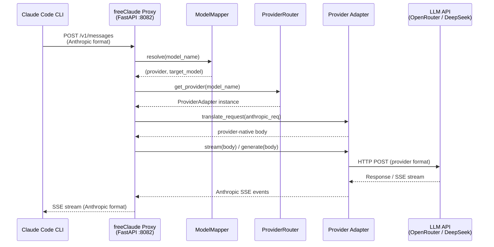
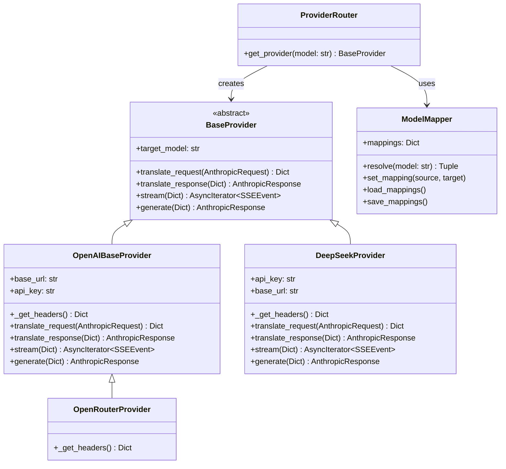
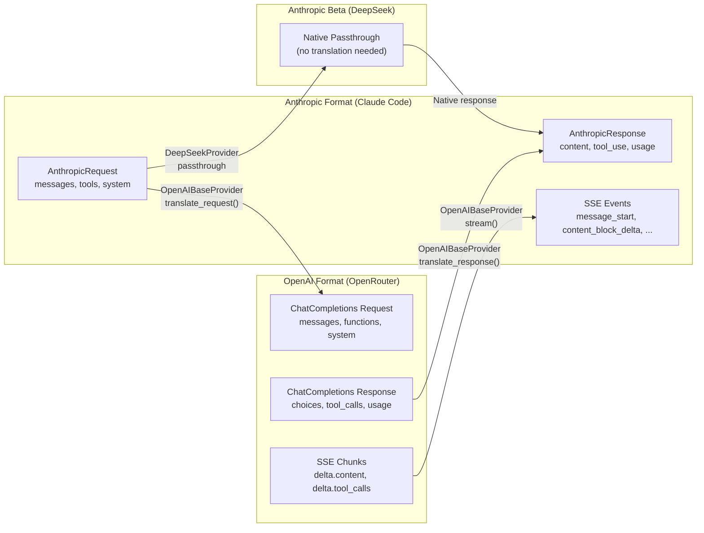

<div align="center">
  <h1>freeClaude</h1>
  <h3><strong>Unlock the Power of Claude Code CLI — Free & Flexible!</strong></h3>

  <p>
    
    
    
    
    
    
    
  </p>

  <p>An intelligent proxy server that seamlessly re-routes Claude Code CLI and VSCode Claude extensions to alternative LLM providers like OpenRouter and DeepSeek. Manage everything through a beautiful integrated Web UI dashboard.</p>

  <p>
    <a href="#features">Features</a> •
    <a href="#architecture">Architecture</a> •
    <a href="#quick-start">Quick Start</a> •
    <a href="#usage">Usage</a> •
    <a href="#configuration">Configuration</a> •
    <a href="#development">Development</a> •
    <a href="#project-structure">Project Structure</a>
  </p>

  <br/>

  
  <br/>
  <i>freeClaude WebUI — Model mapping, provider selection, and one-click project launch</i>
  <br/><br/>
  
  <br/>
  <i>Claude Code CLI running through freeClaude proxy with a DeepSeek backend</i>
</div>

---

## Features

| Feature | Description |
| ------- | ----------- |
| **Multi-Provider Routing** | Transparently routes Anthropic API calls to OpenRouter, DeepSeek, or any OpenAI-compatible provider. |
| **Full SSE Streaming** | Real-time token-by-token streaming with complete Anthropic ↔ OpenAI SSE event translation. |
| **Native Tool Calls** | Bi-directional tool/function call translation, including `toolu_` ID prefixing, ensuring full Claude Code agent compatibility. |
| **Web UI Dashboard** | React + TailwindCSS dashboard for model mapping, provider selection, and one-click project launching. |
| **Dual Provider Strategy** | DeepSeek uses Anthropic-native beta endpoint (zero translation). OpenRouter uses full OpenAI translation layer. |
| **Extensible Architecture** | Clean `BaseProvider → OpenAIBaseProvider` inheritance. Add a new provider in ~20 lines of code. |
| **Comprehensive Test Suite** | 29+ PyTest cases covering models, streaming, tool calls, config, events, and server integration. |

---

## Architecture

### High-Level Request Flow



### Class Hierarchy



### Data Translation Pipeline



---

## Quick Start

### Prerequisites

- **Python 3.11.9+** — Check with `python --version`
- **Node.js 18+ & npm** — For the Web UI frontend
- **Claude Code CLI** — `npm install -g @anthropic-ai/claude-code`
- **API Key** for at least one provider (OpenRouter or DeepSeek)

### Installation

**1. Clone the repository**
```bash
git clone https://github.com/momadhuynh04/freeClaude.git
cd freeClaude
```

**2. Create and activate a Python virtual environment**
```bash
python -m venv venv

# Windows
venv\Scripts\activate

# Linux / macOS
source venv/bin/activate
```

**3. Install Python dependencies**
```bash
pip install -r requirements.txt
```

**4. Configure your environment**

Copy the example config and fill in your API keys:
```bash
cp .env.example .env
```

Edit `.env` with your editor and add your provider API keys. See the [Configuration](#configuration) section for all available options.

**5. Build the Web UI**
```bash
cd webui
npm install
npm run build
cd ..
```

**6. Launch everything**

Use the included batch scripts for a one-click start:
```bash
# Production mode (serves built WebUI on port 8082)
start.bat

# Development mode (Backend :8082 + Vite HMR :5173)
dev.bat
```

Or start the server manually:
```bash
uvicorn proxy.server:app --host 127.0.0.1 --port 8082
```

---

## Usage

Once the proxy server is running:

1. Open the Web UI at `http://127.0.0.1:8082` (production) or `http://localhost:5173` (dev mode).
2. Select your **Target Provider** (OpenRouter or DeepSeek) from the dropdown.
3. Pick the **target model** you want Claude Code to use as its engine.
4. Map it to a Claude model tier (Opus / Sonnet / Haiku) via the dashboard.
5. Click **Launch Project**, select your working directory, and a new terminal will open with Claude Code already connected to your proxy.

Under the hood, the WebUI sets `ANTHROPIC_BASE_URL=http://127.0.0.1:8082` and `ANTHROPIC_API_KEY=freeClaude`, then launches `claude` in that environment. All Anthropic SDK traffic is intercepted and translated transparently.

---

## Configuration

All configuration is done through environment variables in the `.env` file.

### Environment Variables

| Variable | Required | Description |
| -------- | -------- | ----------- |
| `OPENROUTER_API_KEY` | If using OpenRouter | Your OpenRouter API key |
| `DEEPSEEK_API_KEY` | If using DeepSeek | Your DeepSeek Platform API key |
| `DEEPSEEK_BASE_URL_ANTHROPIC` | No | DeepSeek Anthropic-compatible endpoint (default: `https://api.deepseek.com/anthropic`) |
| `DEEPSEEK_BASE_URL_OPENAI` | No | DeepSeek OpenAI-compatible endpoint (default: `https://api.deepseek.com`) |

### Model Mapping

Models are mapped in `.env` using the format `provider/model_name`:
```env
MODEL_OPUS="deepseekplatform/deepseek/deepseek-v4-pro"
MODEL_SONNET="openrouter/qwen/qwen3.7-plus"
MODEL_HAIKU="deepseekplatform/deepseek/deepseek-v4-flash"
```

You can also change mappings live through the Web UI dashboard — changes are persisted to `config.json`.

---

## Development

### Running the Dev Environment

The project ships with a `dev.bat` script that starts both the backend and frontend in development mode with hot-reload:

```bash
dev.bat
# Backend API   → http://127.0.0.1:8082  (uvicorn with auto-reload)
# Frontend UI   → http://localhost:5173   (Vite HMR)
```

### Running Tests

The project includes a comprehensive test suite with **29 test cases** across 8 test files:

```bash
# Activate your venv first
venv\Scripts\activate

# Run all tests
python -m pytest test/ -v

# Run a specific test file
python -m pytest test/test_openai_stream.py -v

# Run with coverage (if installed)
python -m pytest test/ --cov=provider --cov=models --cov=config -v
```

### Test Coverage Map

| Test File | What It Covers |
| --------- | -------------- |
| `test_models.py` | Pydantic model parsing — valid payloads, missing fields, complex content (images, tool blocks) |
| `test_events.py` | SSE event formatting — simple, empty, and deeply nested JSON payloads |
| `test_openai_base.py` | Core translation — Anthropic↔OpenAI content conversion, `toolu_` ID handling, tool schema mapping, `generate()` with mocked HTTP |
| `test_openai_stream.py` | Streaming — Full SSE stream lifecycle for text and tool calls with mocked `httpx` streams |
| `test_openrouter.py` | OpenRouter adapter — Request translation and model override |
| `test_deepseek.py` | DeepSeek adapter — Anthropic passthrough translation |
| `test_config.py` | ModelMapper — Load/save, exact resolve, keyword fallback, error cases |
| `test_server.py` | Server integration — Health endpoint, chat generation, error logging, tool call session validation |

### Adding a New Provider

To add support for a new LLM provider, follow the guide in [`provider/CUSTOM_PROVIDER_GUIDE.md`](provider/CUSTOM_PROVIDER_GUIDE.md). The short version:

1. **Create** `provider/your_provider/adapter.py`
2. **Extend** `OpenAIBaseProvider` (if OpenAI-compatible) or `BaseProvider` (if not)
3. **Register** it in `proxy/router.py`
4. **Map** a model in `.env`

Example for an OpenAI-compatible provider (only ~10 lines):
```python
from provider.openai_base import OpenAIBaseProvider

class MyProvider(OpenAIBaseProvider):
    def __init__(self, target_model: str):
        super().__init__(
            target_model=target_model,
            base_url="https://api.myprovider.com/v1",
            api_key="your-key"
        )
```

### Key Design Decisions

| Decision | Rationale |
| -------- | --------- |
| **DeepSeek uses Anthropic beta endpoint** | DeepSeek offers a native Anthropic-compatible API (`/anthropic/v1/messages`), so we pass through requests without translation. This avoids lossy format conversion and maximizes compatibility. |
| **OpenRouter uses full OpenAI translation** | OpenRouter speaks OpenAI format only, so `OpenAIBaseProvider` handles the complete Anthropic → OpenAI → Anthropic round-trip including tool calls and streaming. |
| **`toolu_` prefix management** | Claude Code CLI validates that tool IDs start with `toolu_`. The translation layer strips this prefix when sending to OpenAI providers and re-adds it when translating responses back. |
| **No custom provider built-in** | A generic "custom provider" was removed because heterogeneous APIs cause too many edge cases. Instead, developers are guided to write their own adapter via `CUSTOM_PROVIDER_GUIDE.md`. |

---

## Project Structure

```
freeClaude/
│
├── proxy/                          # Core proxy server
│   ├── server.py                   # FastAPI app — /v1/messages endpoint, WebUI API, error handling
│   ├── router.py                   # ProviderRouter — resolves model → provider adapter
│   └── server_append.py            # Server startup utilities
│
├── provider/                       # LLM provider adapters
│   ├── base.py                     # BaseProvider — abstract interface all adapters implement
│   ├── openai_base.py              # OpenAIBaseProvider — full Anthropic↔OpenAI translation layer
│   ├── openrouter/
│   │   └── adapter.py              # OpenRouterProvider — extends OpenAIBaseProvider, adds headers
│   ├── deepseekplatform/
│   │   └── adapter.py              # DeepSeekProvider — uses Anthropic beta endpoint (passthrough)
│   └── CUSTOM_PROVIDER_GUIDE.md    # Guide for adding new providers
│
├── models/                         # Pydantic data models
│   ├── anthropic.py                # AnthropicRequest, AnthropicResponse, Message, AnthropicUsage
│   ├── events.py                   # SSEEvent — Server-Sent Event formatting
│   └── openai_compat.py            # OpenAI compatibility types
│
├── config/                         # Configuration & model mapping
│   ├── settings.py                 # Settings — loads .env via pydantic-settings
│   └── model_map.py                # ModelMapper — exact/keyword model resolution, config.json I/O
│
├── test/                           # Test suite (pytest)
│   ├── test_models.py              # Pydantic model parsing tests
│   ├── test_events.py              # SSE event format tests
│   ├── test_openai_base.py         # Core translation + generate tests
│   ├── test_openai_stream.py       # Streaming tests (text + tool calls)
│   ├── test_openrouter.py          # OpenRouter adapter tests
│   ├── test_deepseek.py            # DeepSeek adapter tests
│   ├── test_config.py              # ModelMapper tests
│   └── test_server.py              # Server integration tests
│
├── webui/                          # React + TailwindCSS frontend
│   └── src/
│       ├── App.tsx                 # Main dashboard — provider selection, model mapping, launcher
│       ├── App.css                 # Dashboard styles
│       └── main.tsx                # React entry point
│
├── cli/
│   └── main.py                     # CLI entry point — starts uvicorn server
│
│
├── .env.example                    # Environment config template
├── config.json                     # Persisted model mappings (managed by WebUI)
├── requirements.txt                # Python dependencies
├── start.bat                       # One-click production launcher (Windows)
└── dev.bat                         # One-click development launcher (Windows)
```

---

## License

This project is licensed under the **MIT License** — see the [LICENSE](LICENSE) file for details.

Copyright © 2026 [huynhhoang04](https://github.com/momadhuynh04)
