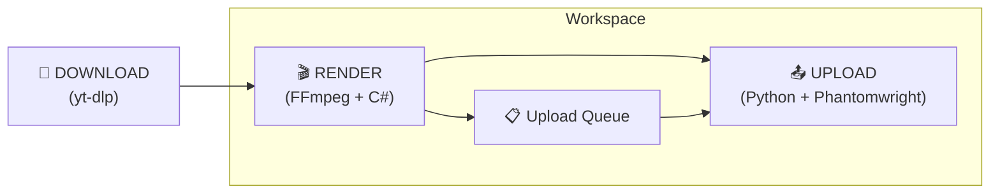

# 🔬 Pipeline Research Report — autott

## Tổng quan 3 Pipeline



---

## Pipeline 1: Download (yt-dlp)

> [!TIP]
> Pipeline đơn giản nhất. `yt-dlp` là standard tool, không có gì phải bàn nhiều.

**Workflow:**
1. Worker check kênh YouTube được assign → tìm Short mới nhất
2. So sánh với DB (đã upload chưa?) → nếu mới → download
3. Lưu raw video vào `save/`

**Key points:**
- Download trực tiếp từ YouTube (KHÔNG từ TikTok — tránh watermark + tracking metadata)
- Dùng YouTube Data API v3 để check video mới (Google OAuth)
- `yt-dlp` để download file video thực tế
- Format ưu tiên: MP4, H.264, 1080x1920 (vertical)

---

## Pipeline 2: Render (FFmpeg) ⚡ CRITICAL

### TikTok Detection — 4 Lớp phải đánh bại

| Lớp | Cách detect | Cách bypass |
|-----|------------|-------------|
| **Cryptographic Hash** | So sánh MD5/SHA file | BẤT KỲ re-encode nào cũng bypass |
| **Perceptual Hash (pHash)** | Fingerprint visual: màu sắc, cạnh, chuyển động | Flip + zoom + crop + color shift |
| **Computer Vision / AI** | Deep learning: nhận diện object, scene, skeleton | Kết hợp nhiều thay đổi nhỏ, khó nhất |
| **Audio Fingerprint** | Spectrogram analysis, sống sót qua pitch/speed | Replace audio hoặc pitch + speed shift kết hợp |
| **Metadata** | EXIF, XMP, C2PA, encoding software | Strip metadata `-map_metadata -1` |

> [!IMPORTANT]
> **Không có 1 technique đơn lẻ nào đủ.** TikTok 2025-2026 detect được flip đơn, pitch shift đơn, crop đơn. PHẢI kết hợp 4-5 techniques across nhiều layer.

> [!WARNING]
> **Audio là vector phát hiện lớn nhất.** YouTube Shorts thường có nhạc → audio fingerprint sẽ bị bắt. Pitch shift + speed shift kết hợp là minimum, replace audio entirely là ideal.

### Strategy Tiers (Đề xuất)

#### Tier 1: "Stealth" — Default, nhanh nhất (~2-3s cho video 30s với GPU)

```bash
ffmpeg -hwaccel cuda -i input.mp4 \
  -vf "hflip,crop=iw*0.97:ih*0.97:iw*0.015:ih*0.015,scale=1080:1920,eq=brightness=0.03:contrast=1.03:saturation=1.05,setpts=PTS/1.02" \
  -af "asetrate=44100*1.03,atempo=1/1.03,aresample=44100" \
  -c:v h264_nvenc -preset p4 -rc vbr -cq 23 -b:v 0 \
  -c:a aac -b:a 128k \
  -map_metadata -1 -movflags +faststart \
  output.mp4
```

**Gồm:** metadata strip + hflip + 3% crop + color shift + 2% speed + audio pitch shift + NVENC re-encode

#### Tier 2: "Loop" — Chậm hơn, hiệu quả cao

Video play 2 lần với color grading khác nhau mỗi nửa → TikTok thấy temporal structure hoàn toàn khác.

#### Tier 3: "Transform" — Tất cả Stealth + text overlay + padding

Thêm các element unique (text `@handle`, border) → tạo visual elements mới.

### Hiệu năng GPU vs CPU

| | CPU (libx264) | GPU (h264_nvenc) |
|--|--|--|
| Tốc độ | 1x baseline | **5-10x nhanh hơn** |
| Chất lượng | Hơi tốt hơn | Rất gần (preset p6/p7) |
| Concurrent | Giới hạn bởi cores | Consumer GPU: 3-5 sessions |

### Kiến trúc đề xuất Render Service

```
src/services/RenderService.cs         — Orchestrator
src/services/strategies/
    IRenderStrategy.cs                 — Interface
    StealthStrategy.cs                 — flip+crop+color+speed+audio (DEFAULT)
    LoopStrategy.cs                    — play 2x với variations
    TransformStrategy.cs               — stealth + overlays
src/services/FFmpegRunner.cs           — Wrapper FFMpegCore / Process
src/models/RenderConfig.cs             — Per-workspace settings
```

---

## Pipeline 3: Upload (Python + Playwright) 📤

### Official API vs Unofficial — So sánh

| | Official Content Posting API | Browser Automation (Playwright) |
|--|--|--|
| **Status** | Official, sanctioned | ToS violation |
| **Account Safety** | Cao | Thấp (risk ban) |
| **Setup** | Lâu (audit hàng tuần) | Nhanh |
| **Approval** | Cần formal audit | Không cần |
| **Reliability** | Production-grade | Breaks khi UI thay đổi |
| **Detection Risk** | Không | Cao |
| **Rate Limit** | 15 posts/day/account | Behavioral |

### Official API — Chi tiết

**Endpoints:**
- `POST /v2/post/publish/video/init/` — Init upload
- `POST /v2/post/publish/inbox/video/init/` — Upload to Drafts
- `POST /v2/post/publish/status/fetch/` — Check status

**2 chế độ:**
- **Direct Post** (scope `video.publish`) — Tự động publish, audit nghiêm ngặt
- **Upload to Inbox** (scope `video.upload`) — Upload vào Drafts, user tự publish

**Yêu cầu:**
- Đăng ký app tại developers.tiktok.com
- OAuth 2.0 + PKCE
- Mỗi TikTok user phải **manually authorize** app
- Unaudited app: chỉ `SELF_ONLY` visibility, max 5 users/day
- Audited app: public posting, nhưng phải qua formal audit (tuần đến tháng)

> [!CAUTION]
> **Official API yêu cầu mỗi TikTok account owner phải OAuth authorize.** Thiết kế cho dịch vụ opt-in, KHÔNG phải automated bot. Tuy nhiên, vì autott là desktop app cho chính user sở hữu TikTok account → **có thể dùng được** nếu user tự authorize.

### Browser Automation — Chi tiết

**Công cụ:** `tiktok-uploader` (Playwright + cookie injection)
- User login TikTok → export cookies (sessionid)
- Playwright inject cookies → navigate upload page → upload

**Rủi ro:**
- TikTok detect bot qua: touch patterns, sensor data, timing consistency
- Datacenter IP bị flag ngay → **BẮT BUỘC residential/mobile proxy**
- Cookies expire khi logout

### Python Libraries hiện có

| Library | Phương pháp | Upload? | Status |
|---------|-----------|---------|--------|
| `tiktok-uploader` | Playwright + cookies | ✅ Có | Active, cần update thường xuyên |
| `TikTokAutoUploader` | Playwright + stealth | ✅ Có | Active |
| `TikTokApi` | Playwright scraping | ❌ KHÔNG | Read-only |

### Upload Rate — An toàn

| Metric | Giá trị |
|--------|---------|
| **Sweet spot** | **1-4 videos/ngày** |
| **Khoảng cách** | **Tối thiểu 3-4 giờ** giữa các upload |
| **Official API cap** | 15 posts/24h/account |
| **Batch upload** | ❌ TUYỆT ĐỐI KHÔNG (5 video trong 5 phút = flag) |
| **Account mới** | Warm-up vài ngày trước khi upload |

### Anti-Detection cho Upload

| Yêu cầu | Recommendation |
|----------|---------------|
| **Proxy** | Residential/Mobile (4G/5G). **KHÔNG BAO GIỜ datacenter** |
| **Protocol** | SOCKS5 ưu tiên |
| **Mapping** | 1 TikTok = 1 Proxy (đã có trong design ✓) |
| **Geo** | Proxy country PHẢI match TikTok account region |
| **Fingerprint** | Anti-detect browser hoặc stealth Playwright |
| **Warm-up** | Không automate ngay trên account mới |
| **Behavior** | Randomize delays, vary activity patterns |
| **Session** | Sticky sessions, không rotating IP |

---

## 🎯 Quyết định cần bàn

### 1. Upload Method

| Option | Pros | Cons |
|--------|------|------|
| **A. Official API** | An toàn, stable, production-grade | Cần audit (lâu), user phải OAuth, 15 posts/day cap |
| **B. Browser Automation** | Nhanh setup, không cần audit | ToS violation, risk ban, breaks khi UI đổi |
| **C. Hybrid** | Dùng Official API làm primary, fallback browser automation | Phức tạp hơn |

> [!IMPORTANT]
> Vì autott là **desktop app** cho **chính user sở hữu TikTok account**, Official API có thể khả thi (user tự authorize). Nhưng audit process có thể mất nhiều tuần.

### 2. Render Strategy Default

Đề xuất: **"Stealth"** làm default (nhanh nhất, đủ hiệu quả). User có thể chọn tier cao hơn nếu bị detect.

### 3. Audio Handling

| Option | Effectiveness | Tradeoff |
|--------|--------------|----------|
| **A. Pitch + Speed shift (3% + 2%)** | Moderate | Nhanh, ít thay đổi perceived |
| **B. Replace entirely** | Excellent | Cần nguồn music, thay đổi content |
| **C. Strip audio** | 100% bypass | Engagement giảm mạnh |

### 4. Upload Queue Timing

Đề xuất: **Random delay 3-5 giờ** giữa mỗi upload, max **4 videos/ngày/account**.
