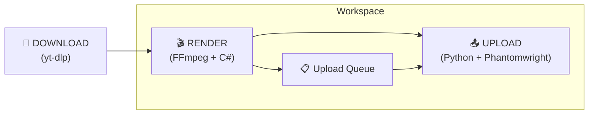
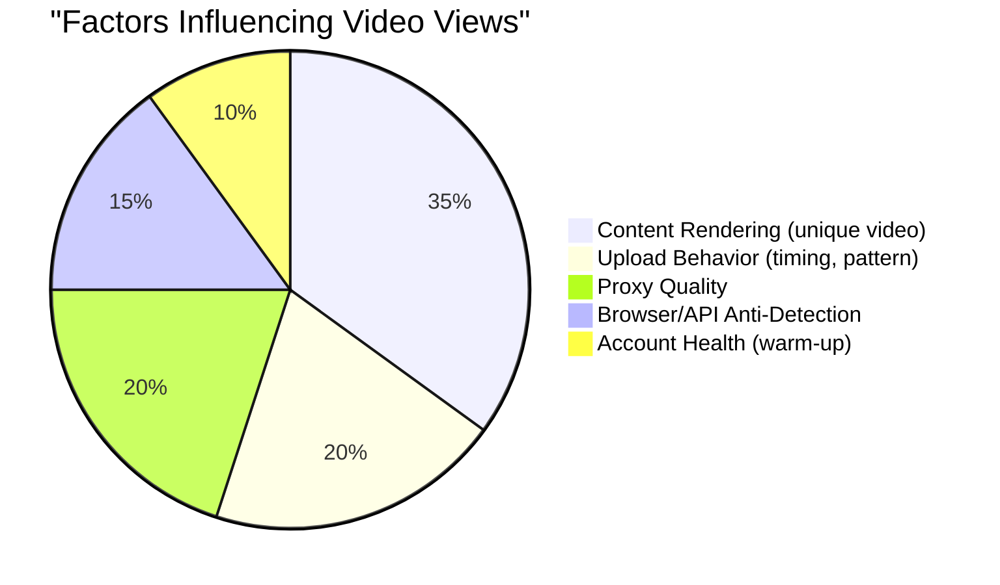

# 🔬 Pipeline Research Report — autott

## 3-Pipeline Overview



---

## Pipeline 1: Download (yt-dlp)

> [!TIP]
> The simplest pipeline. `yt-dlp` is a standard tool, not much to discuss here.

**Workflow:**
1. Worker checks assigned YouTube channel → finds the latest Short
2. Compares with DB (already uploaded?) → if new → download
3. Saves raw video to `save/`

**Key points:**
- Download directly from YouTube (NOT from TikTok — avoids watermarks + tracking metadata)
- Use YouTube Data API v3 to check for new videos (Google OAuth)
- `yt-dlp` to download the actual video file
- Preferred format: MP4, H.264, 1080x1920 (vertical)

---

## Pipeline 2: Render (FFmpeg) ⚡ CRITICAL

### TikTok Detection — 4 Layers to Defeat

| Layer | Detection Method | Bypass Method |
|-----|------------|-------------|
| **Cryptographic Hash** | MD5/SHA file comparison | ANY re-encode bypasses this |
| **Perceptual Hash (pHash)** | Visual fingerprinting: colors, edges, motion | Flip + zoom + crop + color shift |
| **Computer Vision / AI** | Deep learning: object, scene, skeleton recognition | Combine multiple small changes, hardest to bypass |
| **Audio Fingerprint** | Spectrogram analysis, survives pitch/speed changes | Replace audio entirely or combined pitch + speed shift |
| **Metadata** | EXIF, XMP, C2PA, encoding software | Strip metadata `-map_metadata -1` |

> [!IMPORTANT]
> **A single technique is not enough.** TikTok 2025-2026 can detect a simple flip, simple pitch shift, or simple crop. MUST combine 4-5 techniques across multiple layers.

> [!WARNING]
> **Audio is the biggest detection vector.** YouTube Shorts usually have music → audio fingerprinting will catch it. A combined pitch shift + speed shift is the minimum; entirely replacing the audio is ideal.

### Strategy Tiers (Proposed)

#### Tier 1: "Stealth" — Default, fastest (~2-3s for a 30s video with GPU)

```bash
ffmpeg -hwaccel cuda -i input.mp4   -vf "hflip,crop=iw*0.97:ih*0.97:iw*0.015:ih*0.015,scale=1080:1920,eq=brightness=0.03:contrast=1.03:saturation=1.05,setpts=PTS/1.02"   -af "asetrate=44100*1.03,atempo=1/1.03,aresample=44100"   -c:v h264_nvenc -preset p4 -rc vbr -cq 23 -b:v 0   -c:a aac -b:a 128k   -map_metadata -1 -movflags +faststart   output.mp4
```

**Includes:** metadata strip + hflip + 3% crop + color shift + 2% speed + audio pitch shift + NVENC re-encode

#### Tier 2: "Loop" — Slower, highly effective

Video plays twice with different color grading for each half → TikTok sees a completely different temporal structure.

#### Tier 3: "Transform" — All Stealth + text overlay + padding

Add unique elements (text `@handle`, borders) → creates new visual elements.

### GPU vs CPU Performance

| | CPU (libx264) | GPU (h264_nvenc) |
|--|--|--|
| Speed | 1x baseline | **5-10x faster** |
| Quality | Slightly better | Very close (preset p6/p7) |
| Concurrent | Limited by cores | Consumer GPU: 3-5 sessions |

### Proposed Render Service Architecture

```text
src/services/RenderService.cs         — Orchestrator
src/services/strategies/
    IRenderStrategy.cs                 — Interface
    StealthStrategy.cs                 — flip+crop+color+speed+audio (DEFAULT)
    LoopStrategy.cs                    — play 2x with variations
    TransformStrategy.cs               — stealth + overlays
src/services/FFmpegRunner.cs           — Wrapper FFMpegCore / Process
src/models/RenderConfig.cs             — Per-workspace settings
```

---

## Pipeline 3: Upload (Python + Playwright) 📤

### Official API vs Unofficial — Comparison

| | Official Content Posting API | Browser Automation (Playwright) |
|--|--|--|
| **Status** | Official, sanctioned | ToS violation |
| **Account Safety** | High | Low (ban risk) |
| **Setup** | Slow (weekly audits) | Fast |
| **Approval** | Requires formal audit | Not required |
| **Reliability** | Production-grade | Breaks when UI changes |
| **Detection Risk** | None | High |
| **Rate Limit** | 15 posts/day/account | Behavioral |

### Official API — Details

**Endpoints:**
- `POST /v2/post/publish/video/init/` — Init upload
- `POST /v2/post/publish/inbox/video/init/` — Upload to Drafts
- `POST /v2/post/publish/status/fetch/` — Check status

**2 Modes:**
- **Direct Post** (scope `video.publish`) — Auto-publish, strict audit
- **Upload to Inbox** (scope `video.upload`) — Upload to Drafts, user publishes manually

**Requirements:**
- Register app at developers.tiktok.com
- OAuth 2.0 + PKCE
- Each TikTok user must **manually authorize** the app
- Unaudited app: `SELF_ONLY` visibility, max 5 users/day
- Audited app: public posting, but requires formal audit (weeks to months)

> [!CAUTION]
> **The Official API requires each TikTok account owner to authorize via OAuth.** Designed for opt-in services, NOT automated bots. However, because autott is a desktop app for the user who owns the TikTok account → **it is viable** if the user self-authorizes.

### Browser Automation — Details

**Tools:** `tiktok-uploader` (Playwright + cookie injection)
- User logs into TikTok → exports cookies (sessionid)
- Playwright injects cookies → navigates to upload page → uploads

**Risks:**
- TikTok detects bots via: touch patterns, sensor data, timing consistency
- Datacenter IPs get flagged immediately → **Residential/mobile proxy is MANDATORY**
- Cookies expire on logout

### Existing Python Libraries

| Library | Method | Uploads? | Status |
|---------|-----------|---------|--------|
| `tiktok-uploader` | Playwright + cookies | ✅ Yes | Active, requires frequent updates |
| `TikTokAutoUploader` | Playwright + stealth | ✅ Yes | Active |
| `TikTokApi` | Playwright scraping | ❌ NO | Read-only |

### Safe Upload Rates

| Metric | Value |
|--------|---------|
| **Sweet spot** | **1-4 videos/day** |
| **Interval** | **Minimum 3-4 hours** between uploads |
| **Official API cap** | 15 posts/24h/account |
| **Batch upload** | ❌ ABSOLUTELY NOT (5 videos in 5 mins = flag) |
| **New accounts** | Warm up for a few days before uploading |

### Anti-Detection for Uploading

| Requirement | Recommendation |
|----------|---------------|
| **Proxy** | Residential/Mobile (4G/5G). **NEVER datacenter** |
| **Protocol** | SOCKS5 preferred |
| **Mapping** | 1 TikTok = 1 Proxy (already in design ✓) |
| **Geo** | Proxy country MUST match TikTok account region |
| **Fingerprint** | Anti-detect browser or stealth Playwright |
| **Warm-up** | Do not automate immediately on a new account |
| **Behavior** | Randomize delays, vary activity patterns |
| **Session** | Sticky sessions, no rotating IPs |

---

## 🎯 Key Decisions

### 1. Upload Method

| Option | Pros | Cons |
|--------|------|------|
| **A. Official API** | Safe, stable, production-grade | Requires audit (slow), user must OAuth, 15 posts/day cap |
| **B. Browser Automation** | Fast setup, no audit needed | ToS violation, ban risk, breaks on UI updates |
| **C. Hybrid** | Use Official API as primary, fallback to browser automation | Higher complexity |

> [!IMPORTANT]
> Because autott is a **desktop app** for the **user who owns the TikTok account**, the Official API might be viable (user self-authorizes). But the audit process could take weeks.

### 2. Default Render Strategy

Proposal: **"Stealth"** as default (fastest, sufficiently effective). Users can select higher tiers if detected.

### 3. Audio Handling

| Option | Effectiveness | Tradeoff |
|--------|--------------|----------|
| **A. Pitch + Speed shift (3% + 2%)** | Moderate | Fast, minimal perceived change |
| **B. Replace entirely** | Excellent | Requires music source, alters content |
| **C. Strip audio** | 100% bypass | Engagement drops significantly |

### 4. Upload Queue Timing

Proposal: **Random delay 3-5 hours** between each upload, max **4 videos/day/account**.


---
---


# 🔍 Upload Repo Research — Detailed Analysis

## 📊 Analysis: Why 19/20 videos get shadowbanned 

Here is the root cause analysis:

### How `makiisthenes` works
- **Does NOT use Selenium/Playwright** for uploading — sends **HTTP POST directly** to TikTok's internal API (`/tiktok/web/project/post/v1/`)
- Uses a Node.js signature generator to compute `msToken`, `X-Bogus`, `_signature`
- Auth via `sessionid` cookie (logs in once via Playwright, then saves cookies)
- **NO proxy**, **NO anti-detection**, **NO delay management**

### Root causes of the 95% fail rate

```mermaid
fishbone-v2
    title "19/20 Videos Shadowbanned"
    Upload Method
        Raw API calls without browser fingerprint
        Missing device fingerprint (GPU, sensors, touch patterns)
        TikTok detects HTTP client differs from real browser
    Network
        No proxy → same IP for all uploads
        IP pattern = clear automation signal
        Datacenter IP or residential without rotation
    Timing
        No delay between uploads
        Burst pattern (multiple videos at once)
        No new account warm-up
    Content
        Raw video not re-rendered → duplicate detection
        YouTube metadata intact
        Audio fingerprint matches 100%
```

| Root Cause | Impact | Present ? |
|-----------|--------|----------------------|
| No proxy | 🔴 Critical | ❌ Missing |
| No browser fingerprint | 🔴 Critical | ❌ Minimal signature only |
| No delay/queue | 🟠 High | ❌ Uploads immediately |
| Video not re-rendered | 🔴 Critical | ❌ No rendering |
| Metadata not stripped | 🟠 High | ❌ Unhandled |
| Audio kept intact | 🔴 Critical | ❌ Unhandled |
| Account not warmed up | 🟡 Medium | ❌ Missing |

> [!IMPORTANT]
> **Conclusion:** The 5% success rate is not entirely the fault of the upload method — it is a **combination** of: no video rendering + no proxy + bad timing + no anti-detection. Fixing these factors will yield massive improvements.

---

## 🏆 — Current Best Approach

This repo features the **best** anti-detection out of the group:

### Anti-Detection Stack
1. **Phantomwright** — A Playwright fork with a built-in stealth engine
   - Spoofs browser fingerprint (emulates a real browser)
   - Masks automation indicators
   - Simulates human-like interactions
   - Based on `puppeteer-extra-plugin-stealth`
2. **Auto CAPTCHA Solving** — Computer Vision automatically solves TikTok CAPTCHAs
3. **Proxy Support** — Native, recommends residential/mobile
4. **Consistent fingerprint** — Keeps fingerprints consistent per session

### Dependencies
```text
Python 3.9+
Node.js (stealth JS)
phantomwright (pip)
playwright-extra
puppeteer-extra-plugin-stealth
Pillow + inference (CAPTCHA solving)
```

### Limitations
- Semi-active maintenance (last update April 2026)
- Still fragile when TikTok updates UI
- Browser automation is inherently slower than API calls

---

## 💡 Upload Strategy for autott

> [!CAUTION]
> **The harsh reality:** Upload technology only accounts for ~30% of the success rate. **The remaining 70% depends on content rendering + behavior patterns.**

### Impact Breakdown



### Proposed Approach for autott

| Layer | Solution | Priority |
|-------|----------|----------|
| **Render** | Multi-layer FFmpeg (flip+crop+color+speed+audio) | 🔴 P0 — Game changer |
| **Proxy** | Residential/Mobile, 1 per workspace, SOCKS5 | 🔴 P0 |
| **Upload Queue** | Random delay 3-5h, max 4/day, randomized times | 🔴 P0 |
| **Upload Method** | Stealth Playwright (learn from haziq-exe) or Custom internal API with proper signatures | 🟠 P1 |
| **CAPTCHA** | Auto-solve or notify user | 🟡 P2 |
| **Account Warm-up** | Engage naturally for a few days before uploading | 🟡 P2 |

### Upload Method — 2 Options

#### Option A: Stealth Browser (Phantomwright approach)
```text
+ Best anti-detection
+ CAPTCHA solving built-in
+ Native proxy integration
- Slow (must render browser)
- Fragile on TikTok UI updates
- RAM heavy (~200-500MB per browser instance)
```

#### Option B: Internal API + Proper Signatures 
```text
+ Fast (pure HTTP calls)
+ Low resource footprint
+ Independent of UI changes
- Hard to maintain (signature algorithms change)
- Requires Node.js for signature generation
- Less anti-detection than a real browser
```

> [!TIP]
> **Recommend Option A (Stealth Browser)** — while slower, it is much more reliable, has superior anti-detection, and enjoys better community support. Upload speed is not a bottleneck (since the queue already caps at 4 videos/day).
