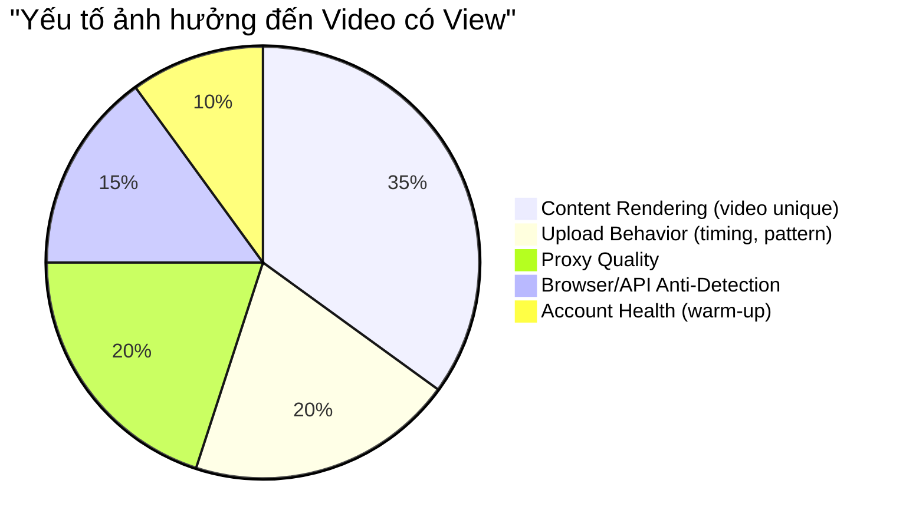

# 🔍 Upload Repo Research — Phân tích chi tiết

### Root causes của 95% fail rate

```mermaid
fishbone-v2
    title "19/20 Videos Bị Shadowban"
    Upload Method
        Raw API calls không có browser fingerprint
        Thiếu device fingerprint (GPU, sensors, touch patterns)
        TikTok detect HTTP client khác browser thật
    Network
        Không proxy → cùng IP cho mọi upload
        IP pattern = automation signal rõ ràng
        Datacenter IP hoặc residential nhưng không rotate
    Timing
        Không delay giữa các upload
        Burst pattern (nhiều video cùng lúc)
        Không warm-up account mới
    Content
        Video raw không render lại → duplicate detection
        Metadata từ YouTube còn nguyên
        Audio fingerprint match 100%
```

| Root Cause | Impact | ? |
|-----------|--------|----------------------|
| Không proxy | 🔴 Critical | ❌ Không có |
| Không browser fingerprint | 🔴 Critical | ❌ Minimal signature only |
| Không delay/queue | 🟠 High | ❌ Upload ngay lập tức |
| Video không render lại | 🔴 Critical | ❌ Không có render |
| Metadata không strip | 🟠 High | ❌ Không xử lý |
| Audio giữ nguyên | 🔴 Critical | ❌ Không xử lý |
| Không warm-up account | 🟡 Medium | ❌ Không có |

> [!IMPORTANT]
> **Kết luận:** Tỉ lệ 5% không phải lỗi hoàn toàn của upload method — mà là **tổ hợp** của: không render video + không proxy + không timing + không anti-detection. Fix được các yếu tố này có thể cải thiện đáng kể.

---

## 🏆 — Approach tốt nhất hiện tại

Repo này có anti-detection **tốt nhất** trong tất cả:

### Anti-Detection Stack
1. **Phantomwright** — Playwright fork có stealth engine built-in
   - Spoof browser fingerprint (giả lập browser thật)
   - Mask automation indicators
   - Human-like interaction simulation
   - Dựa trên `puppeteer-extra-plugin-stealth`
2. **Auto CAPTCHA Solving** — Computer Vision tự giải CAPTCHA TikTok
3. **Proxy Support** — Native, recommend residential/mobile
4. **Consistent fingerprint** — Giữ fingerprint nhất quán per session

### Dependencies
```
Python 3.9+
Node.js (stealth JS)
phantomwright (pip)
playwright-extra
puppeteer-extra-plugin-stealth
Pillow + inference (CAPTCHA solving)
```

### Hạn chế
- Semi-active maintenance (last update April 2026)
- Vẫn fragile khi TikTok update UI
- Browser automation inherently slower hơn API calls

---

## 💡 Chiến lược Upload cho autott

> [!CAUTION]
> **Sự thật phũ phàng:** Upload technology chỉ chiếm ~30% success rate. **70% còn lại phụ thuộc vào content rendering + behavior pattern.**

### Phân tích impact



### Đề xuất approach cho autott

| Layer | Giải pháp | Priority |
|-------|----------|----------|
| **Render** | Multi-layer FFmpeg (flip+crop+color+speed+audio) | 🔴 P0 — Game changer |
| **Proxy** | Residential/Mobile, 1 per workspace, SOCKS5 | 🔴 P0 |
| **Upload Queue** | Random delay 3-5h, max 4/ngày, randomize thời gian | 🔴 P0 |
| **Upload Method** | Stealth Playwright (học từ haziq-exe) hoặc Custom internal API với proper signatures | 🟠 P1 |
| **CAPTCHA** | Auto-solve hoặc notify user | 🟡 P2 |
| **Account Warm-up** | Engage tự nhiên vài ngày trước khi upload | 🟡 P2 |

### Upload Method — 2 lựa chọn

#### Option A: Stealth Browser (Phantomwright approach)
```
+ Anti-detection tốt nhất
+ CAPTCHA solving có sẵn
+ Proxy integration native
- Chậm (phải render browser)
- Fragile khi TikTok update UI
- Tốn RAM (mỗi browser instance ~200-500MB)
```

#### Option B: Internal API + Proper Signatures
```
+ Nhanh (HTTP calls thuần)
+ Ít tốn resource
+ Không phụ thuộc UI changes
- Khó maintain (signature algorithm thay đổi)
- Cần Node.js cho signature generation
- Ít anti-detection hơn browser
```

> [!TIP]
> **Recommend Option A (Stealth Browser)** — tuy chậm hơn nhưng reliable hơn, anti-detection tốt hơn, và community support nhiều hơn. Tốc độ upload không phải bottleneck (vì queue đã giới hạn 4 video/ngày).
